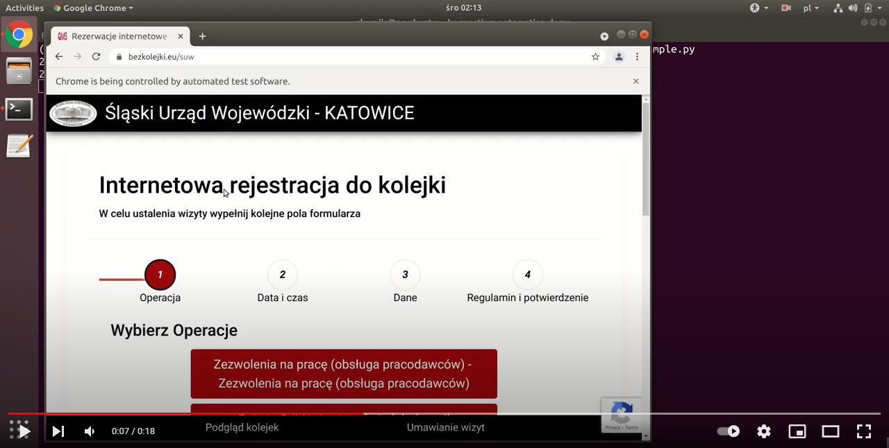

# requestium-automation-demo
**Name:** requestium-automation-demo  
**Description:** Example of booking automation with [Requestium](https://github.com/tryolabs/requestium) Python library on https://bezkolejki.eu/suw  
**GitHub:** https://github.com/korniichuk/requestium-automation-demo  
**Owner:** Ruslan Korniichuk

## Table of Contents
* **[Portability](#portability)**
* **[How to run](#how-to-run)**
  * **[Python script](#python-script)**
* **[FAQ](#faq)**

## Portability
`requestium-automation-demo` checked on Ubuntu Desktop 18.04 LTS operating system.

## How to run
### Python script
**Step 1:** Install operating system packages:
```sh
$ sudo apt update
$ sudo apt install google-chrome-stable
$ sudo apt install chromium-chromedriver
```

**Step 2:** Create `var/log/booking` folder for logger:
```sh
$ sudo mkdir /var/log/booking
$ sudo chown $USER:$USER /var/log/booking
```

**Step 3:** Install Python packages:
```sh
$ pip3 install --upgrade --user --requirement requirements.txt
```

**Note:** You can install Python packages using virtual environments (recommended). Example:
```sh
$ pipenv --python 3.6
$ pipenv shell
$ pipenv install
```

**Step 4:** Run Python script:
```sh
$ python3 booking_auto_example.py
```

[](https://youtu.be/hroRpT8mq6M)

## FAQ
**1. How to generate bezkolejki.eu security token:**
```python3
import requests

url = 'https://bezkolejki.eu/api/Authentication/GetEmptyToken/suw'
r = requests.get(url)
token = r.json()['token']
print(f"token: '{token}'")
```
